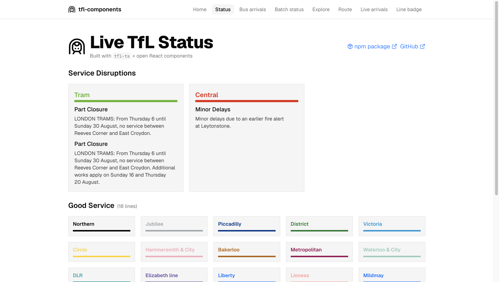
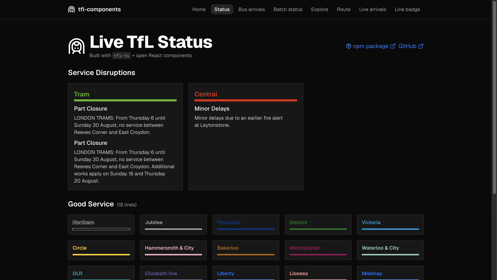

# TfL API TypeScript Client

[](https://badge.fury.io/js/tfl-ts)
[](https://opensource.org/licenses/MIT)
[](https://www.typescriptlang.org/)
[](https://nodejs.org/)

> A typed TypeScript client for the Transport for London API (v2.4.0): friendly wrappers for everyday work, full raw endpoint coverage, and UI helpers for official line colours.

### What you get

- **Friendly wrappers plus a raw escape hatch.** Use `client.line`, `client.stopPoint`, and the other modules for common work. Reach for `client.raw.*` when you need an endpoint the wrappers do not cover yet.
- **Build-time metadata vs live data.** Line names, mode lists, and severity labels ship as constants (no network call). Status, arrivals, and journeys hit the TfL API at runtime. Check things like `client.line.LINE_NAMES` before you fetch.
- **Zero runtime dependencies.** The same client runs in Node.js, the browser, and on the edge.
- **UI helpers included.** Official hex colours (`getLineInlineStyles`, `getLineCssProps`), severity sorting, and accessibility labels. Types are generated from TfL's OpenAPI snapshot.

### Live React boards

Polished status and arrivals UI lives in a separate repo so this package stays framework-agnostic:

[](https://tfl-components.vercel.app/)
[](https://tfl-components.vercel.app/)

Demo: [tfl-components.vercel.app](https://tfl-components.vercel.app) · Source: [ghcpuman902/tfl-components](https://github.com/ghcpuman902/tfl-components)

Copy a board into your Next.js app (installs `tfl-ts` underneath; uses your `TFL_APP_ID` / `TFL_APP_KEY`):

```bash
pnpm dlx shadcn@latest add https://tfl-components.vercel.app/r/tube-status-board.json
pnpm dlx shadcn@latest add https://tfl-components.vercel.app/r/tfl-roundel.json
```

The roundel component ships a filled/rounded placeholder by default. Set `NEXT_PUBLIC_ALLOW_TFL_ROUNDEL=true` in your app to render the official mark (you accept trademark responsibility).
## For AI Agents

Prefer static constants before live requests. That keeps agents from burning API calls on names and IDs that are already in the package.

| Resource | Purpose |
|----------|---------|
| [CLAUDE.md](CLAUDE.md) | Repo-level agent quick-start |
| [docs/agent.md](docs/agent.md) | Full module reference, caching, Next.js patterns |
| [.claude/skills/tfl-ts/SKILL.md](.claude/skills/tfl-ts/SKILL.md) | Claude Skill: usage patterns, gotchas, examples |
| [examples/README.md](examples/README.md) | Library → UI mapping (tube + bus); React/Tailwind optional |
| [CHANGELOG.md](CHANGELOG.md) | Release notes (includes 2.4.0 Northern dark-contrast modes) |
| [tfl-components](https://github.com/ghcpuman902/tfl-components) | React boards + shadcn registry demo |

### Local MCP server

Run `tfl mcp` locally with your own TfL credentials. The server is read-only. Live tools are cached and rate-limited; static tools never call TfL. Responses are compact JSON with a plain-text `summary` field (plus structured fields agents can reuse), not raw TfL dumps.

```json
{
  "mcpServers": {
    "tfl-ts": {
      "command": "npx",
      "args": ["-y", "tfl-ts@latest", "mcp"],
      "env": {
        "TFL_APP_ID": "your-app-id",
        "TFL_APP_KEY": "your-app-key"
      }
    }
  }
}
```

Tools: `get_supported_modes`, `resolve_line_id`, `resolve_stop_id`, `get_line_status` (supports `issuesOnly`), `get_arrivals` (supports `lineIds`), and `plan_journey`. See [docs/mcp.md](docs/mcp.md) and [CHANGELOG.md](CHANGELOG.md).

## Architecture (v2)

tfl-ts v2 is layered so generator and TfL schema changes do not break the friendly wrappers:

```
OpenAPI snapshot (committed)
  → types.ts        (swagger-typescript-api, types only)
  → raw.ts          (owned generator, uniform object-param API)
  → client.raw.*    (public escape hatch: 100% endpoint coverage)
  → wrappers        (human-friendly modules: line, stopPoint, …)
```

- **`pnpm run build`** compiles TypeScript only: no network, no regeneration.
- **`client.raw.<tag>.<method>()`** always exposes every REST endpoint, even before a wrapper exists.
- **`client.realtime`** provides instant-pull polling over REST arrivals (`pollArrivals`, `pollLineArrivals`, `pollVehicleArrivals`). SignalR/URA push is deferred; see [REALTIME.md](docs/REALTIME.md).
- **CLI:** `tfl raw`, `tfl list`, `tfl smoke`, `tfl mcp` (see [Migration Guide](docs/MIGRATION-v2.md)).

```typescript
// Friendly wrapper (recommended)
await client.line.getStatus({ lineIds: ['central'] });

// Raw escape hatch (always available)
await client.raw.line.statusByIds({ ids: ['central'] });
```

### Realtime (instant pull)

Poll live arrivals without SignalR or extra credentials. It uses the same `app_key` as REST:

```typescript
const stop = client.realtime.pollArrivals(
  {
    stopPointIds: ['940GZZLUOXC', '940GZZLUVIC'],
    sortBy: 'timeToStation',
    intervalMs: 30_000,
  },
  (arrivals, meta) => {
    console.log(`[tick ${meta.tick}]`, arrivals.length, 'predictions');
  },
  (error, meta) => console.error(meta.tick, error),
);

// stop polling when done
stop();
```

Interactive demo: `pnpm run playground` → `/arrivals`. CLI: `pnpm run demo:realtime`.

## Getting Started

### 1. Get your API credentials from TfL

First, you'll need to register for free API credentials at the [TfL API Portal](https://api-portal.tfl.gov.uk/). This is required to access TfL's public API.

### 2. Install & Setup

```bash
pnpm add tfl-ts
```

Create a `.env` file in your project root:

```env
TFL_APP_ID=your-app-id
TFL_APP_KEY=your-app-key
```

### 3. Start coding

### Example: get arrivals for a specific tube station

make a new file called `demo.ts` in your project and add the following code:

```typescript
// demo.ts
import TflClient from 'tfl-ts';

const client = new TflClient(); // Automatically reads from process.env

// You can also pass credentials directly
// const client = new TflClient({
//   appId: 'your-app-id',
//   appKey: 'your-app-key'
// });

const main = async () => { // wrap in async function to use await
  // ======== Stage 1: get stop point ID from search ========

  try {
    const query = "Oxford Circus";
    const modes = ['tube'];
    const stopPointSearchResult = await client.stopPoint.search({ query, modes }); // a fetch happens behind the scenes
    const stopPointId = stopPointSearchResult.matches?.[0]?.id;
    if (!stopPointId) {
      throw new Error(`No stop ID found for the given query: ${query}`);
    }

    console.log('Stop ID found:', stopPointId); // "940GZZLUOXC"
  } catch (error) {
    console.error('Error:', error);
    return;
    // For more information on error handling, see the Error Handling Guide in the ERROR.md file
  }

  // ======== Stage 2: get arrivals ========
  try {
    // Get arrivals for Central line at Oxford Circus station
    const arrivals = await client.line.getArrivals({
      lineIds: ['central'],
      stopPointId: '940GZZLUOXC' // from Step 1
    });

    // Sort arrivals by time to station (earliest first)
    const sortedArrivals = arrivals.sort((a, b) => 
      (a.timeToStation || 0) - (b.timeToStation || 0)
    );
    
    sortedArrivals.forEach((arrival) => {
      console.log(
        `${arrival.lineName || 'Unknown'} Line` +
        ` to ${arrival.towards || 'Unknown'}` + 
        ` arrives in ${Math.round((arrival.timeToStation || 0) / 60)}min` +
        ` on ${arrival.platformName || 'Unknown'}`
      );
    });
    /* console output:
      Central Line to Ealing Broadway arrives in 1min on Westbound - Platform 1
      Central Line to Hainault via Newbury Park arrives in 2min on Eastbound - Platform 2
      Central Line to West Ruislip arrives in 4min on Westbound - Platform 1
      Central Line to Epping arrives in 6min on Eastbound - Platform 2
      Central Line to Ealing Broadway arrives in 6min on Westbound - Platform 1
      Central Line to Hainault via Newbury Park arrives in 8min on Eastbound - Platform 2
    */
  } catch (error) {
    console.error('Error:', error);
    return;
  }
}

main().catch(console.error);

```

run the code with

```bash
pnpm run demo
```


## Error Handling

For comprehensive error handling information, including error types, handling strategies, best practices, and troubleshooting, see the **[Error Handling Guide](ERROR.md)** file.

The TfL TypeScript client provides comprehensive error handling with typed error classes and automatic retry logic. All errors are instances of `TflError` or its subclasses, making it easy to handle different types of errors appropriately.

## Examples

See the [playground/demo](playground/demo) folder for runnable v2 examples covering all 14 friendly modules, plus `raw`, `realtime`, UI helpers, and constants.

Quick commands:

```bash
pnpm run demo              # v2 tour across wrappers, raw, and errors
pnpm run demo:realtime     # instant-pull polling demo (live API)
pnpm run playground        # local web playground (includes /arrivals board)
pnpm run demo:smoke        # compile + demo catalog checks (no live API)
pnpm run demo:smoke -- --live  # optional live TfL API smoke for key demos
```

Every REST endpoint remains reachable via `client.raw.*` and `pnpm exec tfl list`; friendly-wrapper demos focus on the curated public API. Individual demos are still runnable by path, for example `pnpm dlx ts-node playground/demo/raw.ts`.

### Autocomplete
Autocomplete for line IDs, modes, etc.


### VS Code showing JSDoc comments
Using the client to get a timetable for a station after search:


### Get real-time tube status

See a live example with UI here: [https://tfl-components.vercel.app/status](https://tfl-components.vercel.app/status)

```typescript
const tubeStatus = await client.line.getStatus({ modes: ['tube'] });
// console output:
[
  // ...
  {
    id: 'central',
    name: 'Central',
    modeName: 'tube',
    disruptions: [],
    created: '2025-06-17T14:58:36.767Z',
    modified: '2025-06-17T14:58:36.767Z',
    lineStatuses: [
      {
        id: 0,
        statusSeverity: 10,
        statusSeverityDescription: 'Good Service',
        created: '0001-01-01T00:00:00',
        validityPeriods: []
      }
    ],
    routeSections: [],
    serviceTypes: [
      {
        name: 'Regular',
        uri: '/Line/Route?ids=Central&serviceTypes=Regular'
      },
      {
        name: 'Night',
        uri: '/Line/Route?ids=Central&serviceTypes=Night'
      }
    ],
    crowding: 'Unknown'
  },
  // ...
]
```

### Pre-generated constants
```typescript
// Pre-generated constants
console.log(client.line.LINE_NAMES);
// console output:
{
  ...
  100: '100'
  sl8: 'SL8',
  sl9: 'SL9',
  suffragette: 'Suffragette',
  tram: 'Tram',
  victoria: 'Victoria',
  'waterloo-city': 'Waterloo & City',
  weaver: 'Weaver',
  'west-midlands-trains': 'West Midlands Trains',
  windrush: 'Windrush',
  'woolwich-ferry': 'Woolwich Ferry'
  ...
}
```

### Validate user input
```typescript
// Validate user input
  const userInput = ['central', '100', 'elizabeth', 'elizabeth-line', 'invalid-line'];
  const validIds = userInput.filter(id => id in client.line.LINE_NAMES);
  console.log(validIds);
  if (validIds.length !== userInput.length) {
    throw new Error(`Invalid line IDs: ${userInput.filter(id => !(id in client.line.LINE_NAMES)).join(', ')}`);
  }

  // console output:
  // [ 'central', '100', 'elizabeth' ]
  // Error: Invalid line IDs: elizabeth-line, invalid-line
```

### Get bus arrivals for a stop
```typescript
  // search for a bus stop using 5 digit code, which can be found on Google Maps
  const query = "51800"; // Aldwych / Kingsway (F)
  const modes = ['bus'];

  const stopPointSearchResult = await client.stopPoint.search({ query, modes });
  const stopPointId = stopPointSearchResult.matches?.[0]?.id;

  if (!stopPointId) {
    throw new Error(`No bus stop found for the given query: ${query}`);
  }
  console.log('Bus stop ID found:', stopPointId);

  // Get arrivals for bus stop
  const arrivals = await client.stopPoint.getArrivals({
    stopPointIds: [stopPointId]
  });

  // Sort arrivals by time to station (earliest first)
  const sortedArrivals = arrivals.sort((a, b) => 
    (a.timeToStation || 0) - (b.timeToStation || 0)
  );
  
  sortedArrivals.forEach((arrival) => {
    console.log(
      `Bus ${arrival.lineName || 'Unknown'}` +
      ` to ${arrival.towards || 'Unknown'}` + 
      ` arrives in ${Math.round((arrival.timeToStation || 0) / 60)}min`
    );
  });

  /* console output:
    Bus stop ID found: 490003191F
    Bus stop Aldwych / Kingsway F:
    Bus 1 to Russell Square Or Tottenham Court Road arrives in 4min
    Bus 188 to Russell Square Or Tottenham Court Road arrives in 6min
    Bus 1 to Russell Square Or Tottenham Court Road arrives in 8min
    Bus 68 to Russell Square Or Tottenham Court Road arrives in 10min
    Bus 68 to Russell Square Or Tottenham Court Road arrives in 12min
    Bus 91 to Russell Square Or Tottenham Court Road arrives in 14min
    Bus 188 to Russell Square Or Tottenham Court Road arrives in 19min
    Bus 68 to Russell Square Or Tottenham Court Road arrives in 22min
    Bus 1 to Russell Square Or Tottenham Court Road arrives in 29min
    Bus 188 to Russell Square Or Tottenham Court Road arrives in 29min
  */
```

Please see the [playground/demo](playground/demo) folder for runnable module examples.

### Search module example
```typescript
const results = await client.search.search({ query: 'Oxford Circus' });
console.log(results.matches?.slice(0, 3));
```

### Vehicle module example
```typescript
const predictions = await client.vehicle.getArrivals({
  vehicleIds: ['LX58CFV', 'LX11AZB']
});
console.log(predictions.length);
```

### Occupancy module example
```typescript
const carParks = await client.occupancy.getAllCarParks();
console.log(carParks[0]?.name, carParks[0]?.bays?.length);
```

### Place module example
```typescript
const places = await client.place.search({
  name: 'Bank',
  placeTypes: ['StopPoint']
});
console.log(places.slice(0, 2));
```

### TravelTimes module example
```typescript
const overlay = await client.travelTimes.getOverlay({
  z: 12,
  mapCenterLat: 51.5074,
  mapCenterLon: -0.1278,
  pinLat: 51.5154,
  pinLon: -0.1419,
  width: 256,
  height: 256,
  scenarioTitle: 'Example',
  timeOfDayId: 'AM',
  modeId: 'tube',
  direction: 'From',
  travelTimeInterval: 15
});
console.log(Object.keys(overlay));
```


### Line Colors and Branding

Get official TfL line hex colours. Framework-agnostic: use with inline styles or your own CSS:

```typescript
import {
  getLineColor,
  getLineCssProps,
  getLineInlineStyles,
  getLineDarkReadableStyles,
} from 'tfl-ts';

// Get line color (hex only; no Tailwind or other framework classes)
const colors = getLineColor('central');
console.log(colors);
// Output: { hex: '#E32017', poorDarkContrast: false }

// API mode IDs are normalized automatically
const elizabeth = getLineColor('elizabeth-line');
// Output: { hex: '#6950A1', poorDarkContrast: false }

// Northern: brand hex stays black; default dark mode uses outline (stroke + hard rings).
// Pass { darkContrastMode: 'white' } for white fill/text on dark surfaces.
const northern = getLineColor('northern');
// { hex: '#000000', poorDarkContrast: true, darkContrastHex: '#ffffff' }
const darkReadable = getLineDarkReadableStyles('northern');
// outline: black fill/text, white stroke + hard shadow rings
const darkWhite = getLineDarkReadableStyles('northern', { darkContrastMode: 'white' });
// white fill/text, no stroke/shadow

// Inline styles for React, Vue, plain HTML, etc.
const styles = getLineInlineStyles('central');
// { color: '#E32017', backgroundColor: '#E32017', borderLeftColor: '#E32017' }

// React example
// <span style={{ color: colors.hex }}>Central</span>
// <div style={{ backgroundColor: colors.hex, height: 4 }} />
// <article style={{ ...getLineCssProps(line.id), borderLeft: `4px solid ${colors.hex}` }} />
// Dark mode (CSS vars): dark:[text-shadow:var(--line-dark-text-shadow)]
//                        dark:[box-shadow:var(--line-dark-box-shadow)]

// CSS custom properties for CSS-in-JS or style={{ ...cssProps }}
const cssProps = getLineCssProps('central');
console.log(cssProps);
// Output: {
//   '--line-color': '#E32017',
//   '--line-color-rgb': '227, 32, 23',
//   '--line-color-contrast': '#000000',
//   '--line-dark-text-shadow': 'none',
//   '--line-dark-box-shadow': 'none'
// }
```

> **Dark contrast:** Default is `outline` — keep brand black and use hard rings / outside text stroke (`--line-dark-text-stroke` + `--line-dark-*-shadow`). Soft glow loses brand identity. Opt into white fill/text with `{ darkContrastMode: 'white' }` on `getLineCssProps` / `getLineDarkReadableStyles`.

### Severity Styling and Classification

Smart severity categorization and styling helpers:

```typescript
import { 
  getSeverityCategory, 
  getSeverityClasses, 
  getAccessibleSeverityLabel 
} from 'tfl-ts';

const severityLevel = 6; // Severe Delays
const description = 'Severe Delays';

// Get severity category for conditional styling
const category = getSeverityCategory(severityLevel); // 'severe'

// Get Tailwind CSS classes with optional animations
const classes = getSeverityClasses(severityLevel, true);
console.log(classes);
// Output: { 
//   text: 'text-orange-700', 
//   animation: 'animate-[pulse_1.5s_ease-in-out_infinite]' 
// }

// Get accessible label for screen readers
const accessibleLabel = getAccessibleSeverityLabel(severityLevel, description);
// Output: 'Severe Delays - Significant delays expected'
```

### Line Status Processing

Utilities for processing and displaying line statuses:

```typescript
import { 
  sortLinesBySeverityAndOrder,
  getLineStatusSummary,
  isNormalService,
  hasNightService,
  getLineAriaLabel
} from 'tfl-ts';

// Get line statuses from API
const lineStatuses = await client.line.getStatus({ modes: ['tube', 'elizabeth-line', 'dlr'] });

// Sort lines by severity and importance (issues first, then by passenger volume)
const sortedLines = sortLinesBySeverityAndOrder(lineStatuses);

// Process each line for display
sortedLines.forEach(line => {
  const summary = getLineStatusSummary(line.lineStatuses);
  const ariaLabel = getLineAriaLabel(line.name, line.lineStatuses);
  const isNormal = isNormalService(line.lineStatuses);
  const hasNightClosure = hasNightService(line.lineStatuses);
  
  console.log(`${line.name}: ${summary.worstDescription} (${summary.hasIssues ? 'Has issues' : 'Good service'})`);
});
```


## Contributing

### Prerequisites
- Node.js 18+
- pnpm (recommended)
- TfL API credentials

### Setup
```bash
git clone https://github.com/ghcpuman902/tfl-ts.git
cd tfl-ts
pnpm install
touch .env  # Add your TfL API credentials
pnpm run build
```

### Build Process

- **Build** (`pnpm run build`): TypeScript compile only (fast, deterministic, no API calls)
- **Full generation** (`pnpm run generate`): Regenerate types, raw client, jsdoc, and metadata from the committed OpenAPI snapshot
- **Sync spec** (`pnpm run sync:spec`): Maintainer-only; fetch live swagger and update snapshot
- **Drift checks** (`pnpm run check:drift`, `pnpm run check:generated`): CI gates for schema and generator output
- **Generation timestamps**: `src/generated/generated.meta.json` (one file; code artifacts stay deterministic)

See [docs/MIGRATION-v2.md](docs/MIGRATION-v2.md) for the v1 → v2 migration guide.

### Scripts
```bash
pnpm run build           # Compile only (default)
pnpm run build:full      # Generate + compile
pnpm run generate        # Regenerate from committed snapshot
pnpm run check:drift     # Compare snapshot vs live REST paths
pnpm run check:generated # Verify committed generated files
pnpm run test            # Run tests
pnpm run demo            # Run v2 tour demo
pnpm run demo:smoke      # Demo catalog + compile smoke check
pnpm run playground      # Interactive playground
pnpm exec tfl list       # List raw endpoints
pnpm exec tfl smoke      # Smoke test live API
```

### Development Pattern
Each API module maps to a generated JSDoc file without importing from it. See [LLM_context.md](LLM_context.md) for detailed development guidelines.

## API Reference

### Core Classes
- `TflClient` - Main client class with `raw` and `realtime` namespaces
- `RawClient` - Direct access to all 84 REST endpoints via `client.raw`
- `Line` - Line and route information
- `StopPoint` - Stop point and arrival information  
- `Journey` - Journey planning
- `Road` - Road traffic information
- `Mode` - Transport mode information

### Key Methods
- `line.getStatus()` - Get line status and disruptions
- `stopPoint.getArrivals()` - Get arrivals for a stop
- `stopPoint.search()` - Search for stops
- `journey.get()` - Plan a journey
- `mode.getArrivals()` - Get mode-specific arrivals

## Troubleshooting

| Issue | Solution |
|-------|----------|
| Invalid API credentials | Check `TFL_APP_ID` and `TFL_APP_KEY` in TfL portal |
| Type generation failed | Verify network access and API permissions |
| Playground not loading | Run `pnpm run build` first |

## License

MIT License - see [LICENSE](LICENSE)

## Acknowledgments

- [Transport for London](https://tfl.gov.uk/) for the public API
- [swagger-typescript-api](https://github.com/acacode/swagger-typescript-api) for type generation
- London developer community for feedback and support

## Support

- Email: [manglekuo@gmail.com](mailto:manglekuo@gmail.com)
- [GitHub Discussions](https://github.com/ghcpuman902/tfl-ts/discussions)
- [GitHub Issues](https://github.com/ghcpuman902/tfl-ts/issues)

## Repository

| Package | Version | License | Size |
|---------|---------|---------|------|
| `tfl-ts` | 2.4.0 | MIT | ~150KB |

| Links | URL |
|-------|-----|
| npm | [tfl-ts](https://www.npmjs.com/package/tfl-ts) |
| GitHub | [ghcpuman902/tfl-ts](https://github.com/ghcpuman902/tfl-ts) |
| Issues | [Report bugs](https://github.com/ghcpuman902/tfl-ts/issues) |
| Discussions | [Community](https://github.com/ghcpuman902/tfl-ts/discussions) |
| Live demo | [tfl-components.vercel.app](https://tfl-components.vercel.app) |

Open source. Track progress via commits; see the roadmap in [LLM_context.md](LLM_context.md).

---

<div align="center">

Built for the London developer community

[](https://github.com/ghcpuman902/tfl-ts)
[](https://github.com/ghcpuman902/tfl-ts)
[](https://www.npmjs.com/package/tfl-ts)

</div>